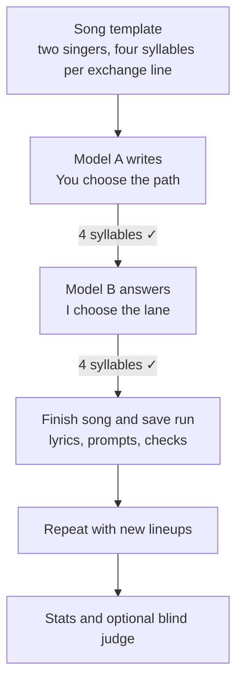

# songbench

songbench runs a songwriting experiment with one language model per singer. A YAML song template sets the section order and line constraints; the tool passes the song between models, checks the lyrics, and saves the full run. You can run a single song or compare models across different singer lineups.

The bundled `two_voices` song is made up for this repo, so you can try the checker and preview the prompts without an API key.

## A run in miniature

Here's one exchange from the synthetic duet. The full song also has an opening, refrain, and ending.



## What a song reveals

A song forces a model to make tradeoffs. It has to say something new, keep the rhythm, and write lines that belong together. A line can hit every syllable and still be dull; a clever line can break the song's shape. songbench puts those demands in the same task.

With two singers, it also becomes a test of building on someone else's idea. The next voice can answer or develop what came before, or write a verse that merely fits the template. Rotating models through the roles shows how they handle both starting a song and carrying one forward.

## Try it locally

Requires Python 3.10 or newer.

```sh
python3 -m venv .venv
. .venv/bin/activate
python -m pip install -e '.[test]'

songbench check examples/two_voices.txt
songbench run --model demo/first --model demo/second --dry-run
pytest
```

`check` scores the example lyrics against the template. `--dry-run` shows the prompts that would be sent to each model; it makes no API calls.

## Write a song

Pick two [OpenRouter model IDs](https://openrouter.ai/models) and set your key:

```sh
export OPENROUTER_API_KEY='your-key'
songbench run --model provider/model-a --model provider/model-b
```

Replace the model IDs with real ones, in singer order. The result prints to the terminal and is saved as a lyric sheet and a JSON run under `runs/`. The JSON includes the prompts, responses, checks, and retries. That directory is ignored by Git.

By default, songbench asks a model to rewrite a part that fails its checks, up to three times. Use `--track freeform` for one attempt per part. Both tracks use the same prompts. You can also set `SONGBENCH_BASE_URL` and `SONGBENCH_API_KEY` to use another OpenAI compatible endpoint.

## Compare models

```sh
songbench matrix --models provider/model-a,provider/model-b,provider/model-c \
  --tracks strict,freeform --samples 2 --dry-run
# Remove --dry-run to generate the songs.
songbench stats runs/
songbench leaderboard runs/ --judge provider/independent-judge
```

`matrix` tries each model in each singer slot. `stats` needs no judge; `leaderboard` asks a judge to compare songs in both presentation orders, then fits an additive Bradley–Terry model to estimate each model's strength, with a 95% interval. Use at least three models (or `--include-self`): with two, every song has the same pair of singers, and only the split of parts between them tells the songs apart. The IDs above are placeholders; use available models, and choose a judge from a different model family than the singers, or repeat `--judge` for a panel from several families, where each pair skips the judges from its own singers' families.

The [CLI reference](docs/reference.md) covers the other settings, judging, and scoring rules.

## Make your own template

A template describes the singers, sections, source lines, and constraints such as syllable counts, stress, rhyme groups, and hooks. A separate scenario says what the singers are writing about; presets can supply finished sections. Start with [`two_voices.yaml`](songbench/data/specs/two_voices.yaml) and the [authoring guide](docs/authoring.md).

## Contributing

The public tests use a scripted model client, so they run without API access. See [CONTRIBUTING.md](CONTRIBUTING.md) before adding examples or fixtures. Licensed under [MIT](LICENSE).
