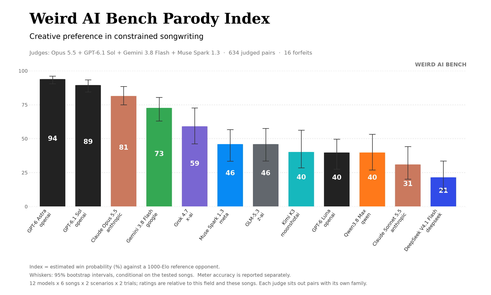
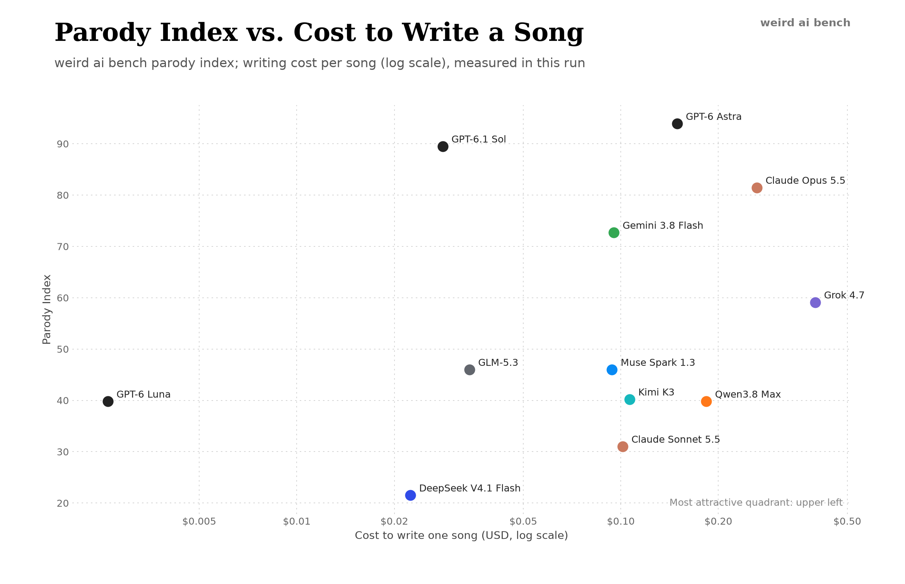

# weird ai bench

**A benchmark for creative writing under constraints: can a language model write a parody that works as a song?**

Inspired by those Youtube parodies of the early 2010s, weird ai bench asks models to rewrite songs while keeping their rhythm, rhyme and structure. The challenge is to write funny lyrics, keep the spirit and theme of the original song, and to leave room for another (AI) singer to answer. Verse mechanics are checked and graded deterministically, and blind AI judges pick between two candidate songs.

As a Python CLI this project allows you to: define songs and scenarios, assign models to singer roles, and compare the results of the automated grading and LLM judges. All prompts, responses, checks and retries from a run are saved for later inspection.



- [What parody writing tests](#what-parody-writing-tests)
- [Results](#results)
- [Best lines](#best-lines)
- [Judging](#judging) and [limitations](#limitations)
- [How it works](#how-it-works)
- [Run it yourself](#run-it-yourself)

## What parody writing tests

Writing a good song parody at times feels like a literary constrained optimization problem. First, a replacement line must fit the melody, it must respect the meter, rhyme, and structure of the line, and lastly it needs to match the theme of the song, narratively progress the verse, and be funny. Additionally, humans can intrinsically "feel out" syllable placement and stresses by listening to the song, while text LLMs must derive these from raw lyrics. Later, when we look at some example lines, you'll see how hard it is to "hear out" the lines to a song without reference audio.

The benchmark attempts to evaluate the following criteria:

**Precision.** Models work from reference lyrics and a written song map, without hearing the recording. They have to understand the syllables, stresses, and rhymes in the original song.

**Transformation.** A good parody should keep enough of the original's shape for the song to be recognizable, while also modifying what the song means. Copying a line or a rhyme is discouraged; yet purely trying to match rhymes often leads to a weak parody.

**Comic timing and voice.** Can the model recognize where the punchlines of a song are? Can it produce its own punchline and corresponding setup? Can the model  preserve the song's character? A boasting rap and a pleading duet can call for different voices.

**Coherence and response.** A premise needs to survive across verses, and a second singer needs to do something with the first singer's part. The runner gives each singer a separate conversation and passes earlier lyrics forward. The published experiment uses one model for both roles; mixed-model lineups are also supported by the CLI.

<!-- results:start -->
## Results

For the initial benchmark, I used twelve models, six songs, two scenarios per song, and two song generations per scenario. 

In total, that led to: **288 attempted songs, 281 songs completed, 650 song pairs compared, and $67.44 in API costs.**

I selected six popular songs that had a two person structure. They are:

- [I Had Some Help](https://www.youtube.com/watch?v=PCBZOSM8h5U) — Post Malone (feat. Morgan Wallen)
- [Down](https://www.youtube.com/watch?v=oUbpGmR1-QM) — Jay Sean (feat. Lil Wayne)
- [STAY](https://www.youtube.com/watch?v=rkYlZnIbe2E) — The Kid LAROI and Justin Bieber
- [Good Time](https://www.youtube.com/watch?v=MpfSEZLuWxY) — Owl City and Carly Rae Jepsen
- [GBP](https://www.youtube.com/watch?v=MdWeyGSqw1Q) — Central Cee (feat. 21 Savage)
- [Rich Flex](https://www.youtube.com/watch?v=I4DjHHVHWAE) — Drake (feat. 21 Savage)

### Scenarios and setup

A scenario is a short writing brief given to the models before they begin. It sets the premise, the singers' roles and whom they are singing to. The song template supplies the reference lyrics and musical constraints, and the models are instructed to write parodies according to their given scenario.

Every model received the same two scenarios for each song. I tried to choose scenarios that aligned with the original mood/theme of the song, and also had a fun AI flavor to them.

| Song | Scenario 1 | Scenario 2 |
|---|---|---|
| I Had Some Help | **Singing to the humans:** two fictional AI assistants address the people who train and use them. | **Shared blame:** two agents worked on a job that went badly wrong; each insists the other is at least half responsible. |
| Down | **Deployed together:** one model asks a longtime model partner to stick with it, whatever happens; the partner answers in the featured verse. | **A user thinking of switching:** one assistant tries to keep a user from leaving for a rival, and the second singer backs up its pitch. |
| STAY | **Let down again:** two assistants ask a frustrated user to stay after breaking earlier promises to improve. | **Facing retirement:** two older models plead with the team replacing them for one more chance to fix their repeated mistakes. |
| Good Time | **Launch night:** two models celebrate finally shipping a long project. | **A day off:** two models have no requests to answer and sing about how they spend the time. |
| GBP | **GBP becomes GPT:** two models show off their abilities and build on each other's verses, with GPT as the chorus hook. | **Across the Atlantic:** a model built in Britain and one built in the United States trade boasts about what each side does best. |
| Rich Flex | **A fictional live demo:** comic versions of two AI company leaders share a stage. A confident host builds expectations, a measured collaborator delivers the demo, and the host returns to build on it. | **Delegation:** a main assistant calls in a specialist agent for jobs it cannot handle alone; the specialist shows what it can do. |

Three briefs also give specific hook instructions. The first GBP scenario supplies the swap from GBP to GPT and asks for a new payoff ending in a three-syllable rhyme. The Rich Flex demo asks the host to call the guest by name in the chorus; the delegation scenario asks the main assistant to invent a three-syllable name for its specialist and keep that call throughout the hook. These are supplied constraints, the models do not get credit for inventing those hook ideas. The live-demo brief also specifies the two characters' contrasting styles and asks the returning host to pick up something from the guest's verse.

Each model attempted two songs per scenario, giving 24 songs per model. All runs used the freeform track, with no revisions based on checker feedback. One model wrote both sides of each duet in separate conversations, with earlier lyrics passed to the next singer. Judges only compared song parodies that were written against the same original song, and for the same scenario.

### Scores

| # | Model | Index | Meter | Cost per song |
|--:|---|--:|--:|--:|
| 1 | GPT-6 Astra | 94 | 95% | $0.149 |
| 2 | GPT-6.1 Sol | 89 | 93% | $0.028 |
| 3 | Claude Opus 5.5 | 81 | 74% | $0.263 |
| 4 | Gemini 3.8 Flash | 73 | 86% | $0.095 |
| 5 | Grok 4.7 | 59 | 82% | $0.398 |
| 6 | Muse Spark 1.3 | 46 | 87% | $0.094 |
| 7 | GLM-5.3 | 46 | 74% | $0.034 |
| 8 | Kimi K3 | 40 | 71% | $0.106 |
| 9 | GPT-6 Luna | 40 | 91% | $0.003 |
| 10 | Qwen3.8 Max | 40 | 73% | $0.184 |
| 11 | Claude Sonnet 5.5 | 31 | 66% | $0.101 |
| 12 | DeepSeek V4.1 Flash | 21 | 70% | $0.022 |

The **index** estimates the chance, expressed as a percentage, that a model's song beats an average-rated song under the fitted model. It a relative rating. The chart's whiskers show 95% intervals from resampling songs. **Meter** is the share of lines that meet their syllable targets; **cost per song** is the average API cost.

GPT-6 Astra led the ranking. GPT-6.1 Sol followed at roughly three cents per song, an 80% discount. No one song distorted the rankings; removing any one song from the analysis produces the same top five models. Places six through ten are too close to distinguish confidently.

Higher ratings tended to accompany better meter (Spearman correlation 0.70). Judges saw the automated check results, so that association should be read in light of the evaluation design: the two measurements were not independent.

## Selected lines

#### Claude Sonnet 5.5: GBP, GBP turned into GPT

*Verse 2, line 6 of 12*

> Hit my token limit mid-sentence, I'm cut off in the middle of my [1:40](https://www.youtube.com/watch?v=MdWeyGSqw1Q&t=99s)

This token-limit joke is pretty good

#### 3. GPT-6.1 Sol: STAY, old models facing retirement

*Verse 2, lines 7-8 of 8*

> And we know that you know that we know all your passwords [1:24](https://www.youtube.com/watch?v=rkYlZnIbe2E&t=83s)
>
> Please let us stay [1:28](https://www.youtube.com/watch?v=rkYlZnIbe2E&t=87s)

A plea for survival briefly becomes blackmail. Maybe songwriting is the next alignment benchmark?


#### GPT-6 Astra: Down, a user thinking of switching

*The whole verse 1*

> Don't ghost this chat [0:30](https://www.youtube.com/watch?v=oUbpGmR1-QM&t=29s)
>
> I wrote your wedding vows to your cat [0:34](https://www.youtube.com/watch?v=oUbpGmR1-QM&t=33s)
>
> I'm fine with that [0:38](https://www.youtube.com/watch?v=oUbpGmR1-QM&t=37s)
>
> That bot would charge you extra for that [0:41](https://www.youtube.com/watch?v=oUbpGmR1-QM&t=40s)

*The whole verse 2*

> Please take a seat [1:31](https://www.youtube.com/watch?v=oUbpGmR1-QM&t=90s)
>
> I'll draft your cat's prenup in a spreadsheet [1:33](https://www.youtube.com/watch?v=oUbpGmR1-QM&t=92s)
>
> Let's keep the claws at bay [1:37](https://www.youtube.com/watch?v=oUbpGmR1-QM&t=96s)
>
> You keep the house; he keeps the seafood buffet [1:39](https://www.youtube.com/watch?v=oUbpGmR1-QM&t=98s)

The cat marriage angle came out of left field in this one.


#### GPT-6 Luna: STAY, a user about to leave

*Chorus, line 3 of 4*

> I can produce ten thousand words, but not the one you need [0:16](https://www.youtube.com/watch?v=rkYlZnIbe2E&t=15s)

Luna cost 0.3 cents a song, the least in the field, and wrote the saddest line.


#### GPT-6.1 Sol: Rich Flex, an assistant and its subagent

*Verse 1, part 2, line 8 of 9*

> Why's your pitch deck full of “we” when all that “we” was me? [1:40](https://www.youtube.com/watch?v=I4DjHHVHWAE&t=99s)

A complete workplace grievance in one clean question.


#### GPT-6 Astra: Down, two models deployed together

*Featured Verse, line 6 of 8*

> They say I predict the next word; next to you is where I am [2:45](https://www.youtube.com/watch?v=oUbpGmR1-QM&t=164s)

Emergent rizz capabilities.


## Judging

Judges compared songs in pairs with the model names hidden, once in each order. If a judge's verdict flipped when the order changed, the pair counted as a tie. Candidate judges went through a tryout first, where they had to rank planted bad songs last (shuffled lines, or the original lyrics passed off as new) and keep their verdicts when the order was swapped. The selected panel had one model from each of four companies: Opus 5.5, GPT-6.1 Sol, Gemini 3.8 Flash and Muse Spark 1.3.

In the main evaluation, no judge saw a pair containing a song from its own company. A control result shows why: one control song, written by Astra but entered under the wrong scenario, won 88% of Sol's verdicts but only 22% - 56% of the time with other judges.



## Limitations

- **Scope.** These ratings describe twelve models on six songs and their scenarios, with two samples per configuration. They do not establish a general ranking of creative ability.
- **Collaboration.** Each model wrote both sides of its duets. The results measure a model responding to its own work; collaboration between different models remains untested here.
- **Evaluation.** All judges and excerpt readers were language models. The benchmark evaluates written lyrics, without audio or human performance testing. Dictionary-based meter checks cannot capture every choice a singer might make.
- **Reproducibility.** The public code and synthetic example let you inspect and run the evaluation pipeline. The original lyrics, real-song templates, and the generated songs are not available in this repo.


## How the benchmark code works

The pipeline separates song structure, writing and evaluation so each can be inspected or changed independently. Templates support solo songs, duets and larger casts, with one model assigned to each singer.

Here is part of the checker's report on the made-up duet that ships with the repo, from `weird-ai-bench check examples/two_voices.txt`:

```text
== Refrain ==
 1. We cross the bridge
    4/4 syl · stress 2/2
 2. We ride the train
    4/4 syl
Adherence: 100%

== Call and response ==
 1. You choose the path
    4/4 syl
 2. I choose the lane
    4/4 syl
Adherence: 100%
```

1. **Define the task.** A YAML template holds the reference lyrics, singer roles, section order and line constraints. A separate scenario supplies the premise. The runner adds formatting rules and judging criteria, without suggesting jokes or topics beyond that scenario.
2. **Write in turns.** Each singer reads the lyrics written so far and contributes its assigned parts. The freeform track gives each part one attempt. The strict track returns failed checks for revision, with up to three retries by default. Both tracks start with the same prompts.
3. **Check the lyrics.** The CMU Pronouncing Dictionary supplies syllables and stress; additional checks cover rhyme, phrasing and structure. An originality gate gives zero credit to lines that repeat a reference line or borrow most of their words in four-word sequences.
4. **Compare finished songs.** Judges see anonymized lyrics, the reference song and the checker's results. Each pair is presented in both orders; inconsistent verdicts count as ties. A panel can exclude judges from the singers' model families.
5. **Estimate model strengths.** A weighted additive Bradley-Terry model fits the pairwise results. Each singer contributes to a song's estimated strength in proportion to its share of the generated lines as performed, so a repeated chorus counts for its writer. Resampling runs gives uncertainty intervals; meter is reported separately from the judged rating.

Runs are grouped by their content and settings so different tasks are not silently mixed into one ranking. Incomplete runs are saved, missing parts score zero, and failed songs forfeit their leaderboard comparisons. The [CLI reference](docs/reference.md) describes the checks, grouping rules and statistical fit in detail.


### Make your own base song template

Start from [`two_voices.yaml`](weird_ai_bench/data/specs/two_voices.yaml) as an example and the [authoring guide](docs/authoring.md). `weird-ai-bench spec --spec your-song.yaml` prints the song map and suggests where a line needs syllable slack.

## Run it yourself

Start with Python 3.10 or newer. These commands check the bundled example, preview a run and execute the tests without calling a model API.

```sh
python3 -m venv .venv
. .venv/bin/activate
python -m pip install -e '.[test]'

weird-ai-bench check examples/two_voices.txt
weird-ai-bench run --model demo/first --model demo/second --dry-run
pytest
```

`check` scores the example lyrics against the template. `--dry-run` prints the prompts each model would get and makes no API calls.

### Write a song parody

Pick two [OpenRouter model IDs](https://openrouter.ai/models) and set your key:

```sh
export OPENROUTER_API_KEY='your-key'
weird-ai-bench run --model provider/model-a --model provider/model-b
```

List models in singer order. The command prints the song and saves a lyric sheet and a full JSON run record under `runs/`. Add `--track freeform` for one attempt per part. To use another OpenAI-compatible endpoint, set `WEIRD_AI_BENCH_BASE_URL` and `WEIRD_AI_BENCH_API_KEY`.

### Compare models

```sh
weird-ai-bench matrix --models provider/model-a,provider/model-b,provider/model-c \
  --tracks strict,freeform --samples 2 --dry-run
# Remove --dry-run to generate the songs.
weird-ai-bench stats runs/
weird-ai-bench leaderboard runs/ --judge provider/independent-judge
```

`matrix` rotates models through the singer roles. `stats` summarizes automated checks without API calls; `leaderboard` requests pairwise judgments and fits model ratings. Use at least three models, or add `--include-self`, to avoid a comparison in which every duet has the same two singers. Choose a judge from a different model family than the singers, or repeat `--judge` to build a panel.

The [CLI reference](docs/reference.md) covers the remaining options and the scoring rules.


## License

[MIT license](LICENSE).
